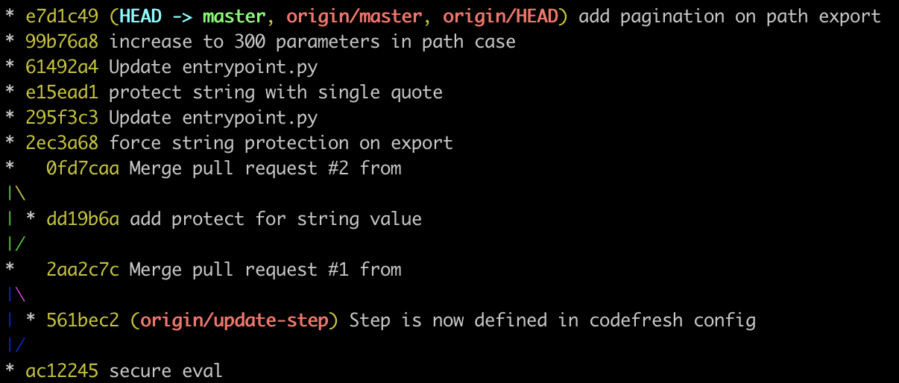

<!-- _class: lead -->
# <!--fit--> **Git**: 
# <!--fit--> _master all secrets_
<br />

<base target="_blank" />

<script async src="https://www.googletagmanager.com/gtag/js?id=G-55YPBZQY0M"></script>
<script>
  window.dataLayer = window.dataLayer || [];
  function gtag(){dataLayer.push(arguments);}
  gtag('js', new Date());
  gtag('config', 'G-55YPBZQY0M');
</script>

---

 
<br />
## &nbsp;&nbsp;&nbsp;&nbsp;&nbsp;Laurent RICHARD
<br />

##### **OpenClassrooms** _Infrastructure Manager_

<br />

[](https://twitter.com/_LaurentRICHARD) [](https://www.linkedin.com/in/larichard/) [](https://github.com/easylo/)

---


<br />

### At OpenClassrooms, we believe that everybody can learn anything and that everybody has something to share.

### Our mission is to make education accessible. To everybody. Everywhere. We’re working to do that every day, and we have been doing it for 20 years.

### Mathieu Nebra started OpenClassrooms when he was 13 years old and was soon joined by Pierre Dubuc.

---


# [Join the Infrastructure Team](https://jobs.openclassrooms.com/fr/jobs/1196158-devops-engineer-h-f-x)

---

> Initialize an existing directory as a Git repository

<br />

```bash
$ git init
$ git init --initial-branch=main # define the initial branch name
$ git init -b=main # short version
```

---

> Makes a duplicate of an existing Git repository. 
> _Cloning is the most popular method through which developers receive a working copy of a central repository._

<br />

```bash
$ git clone <url> 
$ git clone <url> <repo_name>
```

---

> Add a git URL as an alias

<br />

```bash
git remote add <alias> <url>
```

---

> It tells Git that you want to include updates to all your files in the next commit.

<br />

```bash
git add .
```

---

> Add a file as it looks now to your next commit

<br />

```bash
git add <file>
```

---

<!-- > Takes all added files and commits them to the project history. Combined with git add, this defines the basic workflow for all Git users. -->
> Create a new commit containing the current contents of the index and the given log message describing the changes.

<br />

```bash
git commit -m "description"
```

---

> It moves all your committed changes to the remote repository.

<br />

```bash
git push
```

---

> Transmit local branch commits to the remote repository branch

<br />

```bash
git push <alias> <branch>
```

---

> Push all of your local branches to the specified remote

<br />

```bash
git push --all
git push <remote> --all
```

---

> Tags are not automatically pushed when you push a branch or use the --all option. The --tags flag sends all of your local tags to the remote repository.

<br />

```bash
git push --tags
git push <remote> --tags
```

---

> Displays the current status of the working directory. You should use it in combination with git add and git commit to know what files were added and committed.

<br />

```bash
git status
```

---

> List your branches. a * will appear next to the currently active branch

<br />

```bash
git branch
```

---

> Create a new branch at the current commit

<br />

```bash
git branch <branch_name>
```

---

> Create a new branch at the current commit

<br />

```bash
git branch -M main
```

---

> Creates a new branch on your local machine and opens it.

<br />

```bash
git checkout -b <new_branch_name>
```

---

> Delete a branch on your local filesystem.

<br />

```bash
git branch -d <branch_name>
```

Note: I always delete branches locally through this command and use GitHub UI to delete them globally. Seems for me like the safest method.

---

> Delete a branch on remote.

<br />

```bash
git branch -D <branch_name>
```

---

> Integrate all changes from another branch into yours.

<br />

```bash
git merge <branch_name>
```

---

> By calling it, you will get all changes from the remote branch to your local copy.

<br />

```bash
git pull
```

---

> Fetch down all the branches from that Git remote

```bash
git fetch
git fetch <remote>
git fetch <remote> <branch>
git fetch --all # fetches all branches of all remotes
```

```bash
git fetch --dry-run
```

#### _The --dry-run option will perform a demo run of the command. It will output examples of actions it will take during the fetch but not apply them._

---

> Stores uncommitted changes (both staged and unstaged) for later use and subsequently reverts them from your working copy.

<br />

```bash
git stash
```
_You aren't limited to a single stash_

---

> List stashes

<br />

```bash
$ git stash list
```

```bash
stash@{0}: WIP on main: 5002d47 our new homepage
stash@{1}: WIP on main: 5002d74 our new contact page
stash@{2}: WIP on main: 5002d88 our new support page
```

---

> Reapply previously stashed changes


```bash
git stash pop
```
<br />

> Choose which stash to re-apply
```bash
git stash pop stash@{2}
```

---

> Discard the changes from top of stash stack

<br />

```bash
git stash drop
```

---

> Show all commits in the current branch’s history

```bash
git log
```
<br />


> Limit the number of commits that are displayed

```bash
git log -3
```

---

> Show all commits in the current branch’s history and display message in one line.

<br />

```bash
git log --pretty=oneline
```

---

> "A Dog" = --**a**ll --**d**ecorate --**o**neline --**g**raph


```bash
git log --all --decorate --oneline --graph
```



---

> Looking for a commit from a specific time frame.


```bash
git log --before="2021-12-25"
git log --after="2021-12-1"
git log --after="yesterday"
git log --after="1 week ago"
git log --after="2021-12-1" --before="2021-12-25"
```

#### _Note that the --since and --until flags are synonymous with --after and --before, respectively._

---

> Filter commits by their commit message.

<br />

```bash
git log --grep="JRA-123:"
```

---

> If you’re only interested in changes that happened to a particular file.

<br />

```bash
git log -- foo.py bar.py
```

---

> Show the commits on **branchA** that are not on **branchB**.

<br />

```bash
git log branchB..branchA
```

---

> Diff of what is changed but not staged

<br />

```bash
git diff
```

---

> Diff of what is staged but not yet commited

<br />

```bash
git diff --staged
```

---

> Show the diff of what is in **branchA** that is not in **branchB**

<br />

```bash
git diff branchB...branchA
```

---

> List existing tags in Git.

<br />

```bash
git tag
```

---

> It removes everything in the staging area

<br />

```bash
git reset 
```

---

> Unstage a file while retaining the changes in working directory

<br />

```bash
git reset <file>
```

---

> Clear staging area, rewrite working tree from specified commit

<br />

```bash
git reset --hard <commit>
```

---

> Apply any commits of current branch ahead of specified one

<br />

```bash
git rebase <branch>
```

---

> improve your productivity

```bash
$ git config --global alias.co checkout
$ git config --global alias.br branch
$ git config --global alias.ci commit
$ git config --global alias.st status
$ git config --global alias.unstage 'reset HEAD --'
```

---

<br />
<br />

```bash
# ~/.gitconfig
    [alias]
        co = checkout
        br = branch
        ci = commit
        st = status
        unstage = 'reset HEAD --'
```
